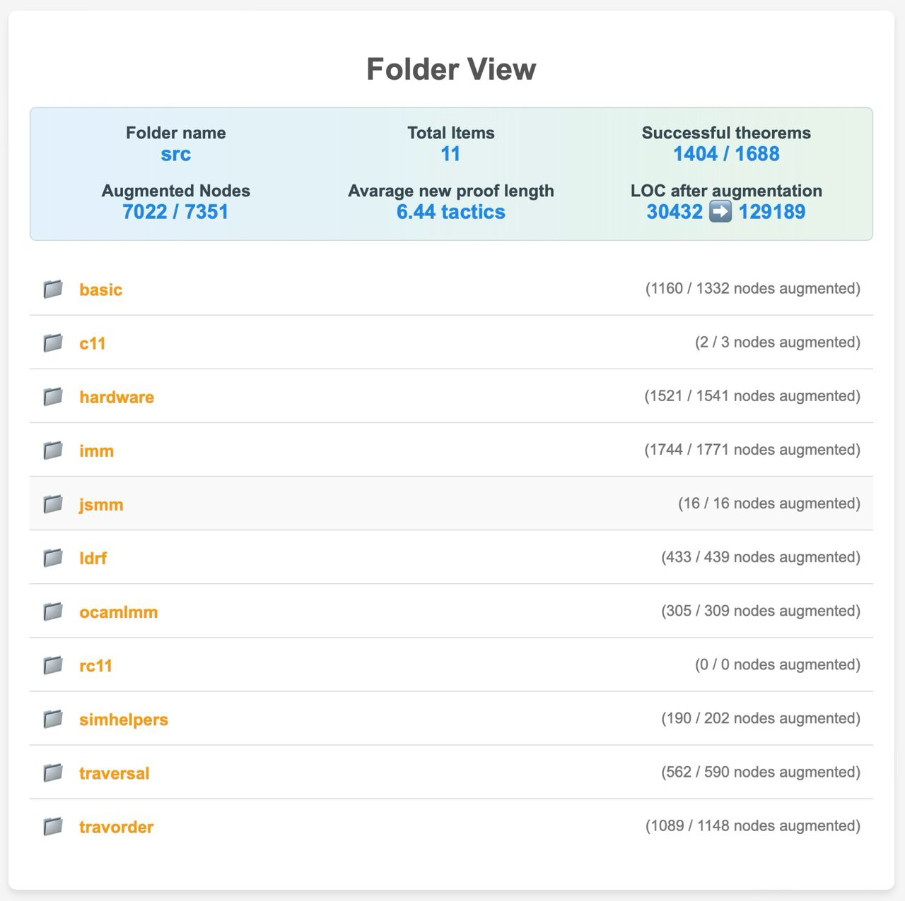

# BigRocq 

`BigRocq` is a utility, that takes a Rocq (former Coq) project as input and uses domain knowladge to increase a number of theorems in the dataset by a significant factor. It produces new theorems from existing ones. Using [coq-lsp](https://github.com/ejgallego/coq-lsp) `BigRocq` type-checks theorems, transforms linearly structured proofs into a tree like structure and then produces new proofs using the fact that each subtree in such a tree could be represented as a separate sub-statement. All produced theorems are type-checked and are guaranteed to be well-formed.

# Table of Contents

- 🌍 [BigRocq Overview](#bigrocq-version)
- 📦 [Requirements](#requirements)
- 🔧 [Installation](#installation)
  - 🏗 [Coq-LSP Installation](#coq-lsp-installation)
  - ⚙️ [Usage prerequisites](#usage-prerequisites)
- 🎯 [Usage guide](#usage-guide)
- 🖥️ [Example Results](#example-results)
- 🚧 [Future plans](#future-plans)

## Requirements

* `coq-lsp` version `0.2.0` or higher is currently required to run the extension. Supported versions of `Rocq` are `8.18` and higher.

## Installation

### Coq-LSP installation

To run the extension, you must install a `coq-lsp` server. Depending on the system used in your project, you should install it using `opam` or `nix`. A well-configured `nix` project should have the `coq-lsp` server installed as a dependency. To install `coq-lsp` using `opam`, you can use the following commands: 
```bash
opam pin add coq-lsp 0.2.2+8.19
opam install coq-lsp
```
For more information on how to install `coq-lsp` please refer to [coq-lsp](https://github.com/ejgallego/coq-lsp). 

If the [coq-lsp](https://github.com/ejgallego/coq-lsp) extension works well and you can see the goals and theorems in the VSCode, then `BigRocq` should work as well.

## Usage prerequisites

First, clone the `BigRocq` repository and navigate into its directory.

To build the utility locally, you'll need Node.js installed. The recommended way to manage Node.js versions is by using `nvm`. From the `BigRocq` root directory, execute:
```bash
nvm use
```
If you prefer not to use `nvm`, ensure you install the Node.js version specified in the [`.nvmrc`](.nvmrc) file by any other method you prefer.

Once Node.js is installed, the remaining setup will be handled by the `npm` package manager. Run the following commands:
```bash
npm install
npm run compile
```

## Usage guide

**IMPORTANT**: Be aware, that if you are using `nix`, then, just like in [coqpilot](https://github.com/JetBrains-Research/coqpilot), you will need to run the commands from inside the `nix-shell`, in addition, you need to make sure, that the project dependencies are correctly resolved by the coq-lsp server. 

Utility provides a command-line interface to augment projects. The main contributed command is: 
```bash
npm run augment 
```

Arguments are passed after `--`. The help command could be ran using `npm run augment -- -h` and it will print the following:
```
========================================

BigRocq

  This utility takes a Coq project as input and uses some domain knowladge to   
  increase a number of theorems in the dataset by a significant factor.         

Options

  -p, --targetRootPath string            Path to the directory which will be a  
                                         target for augmentation. Could be a    
                                         directory or a single file, in most    
                                         cases it's an src folder of the        
                                         project. Please provide an absolute    
                                         path.                                  
  -w, --workspaceRootPath string         Path to the root of the Coq project.   
                                         The path, where the _CoqProject file   
                                         is located. Please provide an absolute 
                                         path.                                  
  -c, --coqLspServerPath string          Path to the Coq LSP server executable. 
                                         By default, it is assumed that the     
                                         server is in the PATH and is called    
                                         'coq-lsp'. If you are using nix please 
                                         provide the full path to the           
                                         executable.                            
  -t, --fileAugmentationTimeout number   Every produced sample is checked       
                                         manually to be correctly               
                                         compiling/type-checking. This timeout  
                                         means how much time you give the util  
                                         to check all new samples for a single  
                                         theorem.                               
  --fileTimeout number                   Non-trivially explainable semantics.   
                                         Set bigger if you have files with a    
                                         lot of theorems or in case you fail    
                                         with timeout.                          
  --generateDatasetViewer                Generate a simple HTML viewer for the  
                                         dataset. It will be saved in the       
                                         targetRootPath.                        
  --generateAugmentedCoqFiles            Whether to generate the augmented Coq  
                                         files which will contain all augmented 
                                         samples in the place of initial        
                                         theorems.                              
  -v, --version                                                                 
  --verbose                                                                     
  -d, --debug                                                                   
  -h, --help                                                                    

========================================
```

The obligatory arguments are `--targetRootPath` and `--workspaceRootPath`, but don't forget to override the default `--coqLspServerPath` if you are using `nix` or `coq-lsp` server is not in the PATH.

`BigRocq` produces the augmented dataset and the viewer for it (if `--generateDatasetViewer` is set to `true`) in the root from where the utilitty was called. The viewer is a collection of HTML pages, that allows you to navigate through the dataset and see the proofs and view statistics. Alongside, in the `tempDatasetView` folder an `augmentedFiles` subdirectory is generated (when `--generateAugmentedCoqFiles` is set to `true`), which contains the augmented Coq files.

## Example Results

Running `BigRocq` on the [IMM](https://github.com/weakmemory/imm) project succeded in about 5 hours (due to the size of the project and the fact that we need to compile a tremendous amount of new theorems). The project was augmented by a factor of ~4, lines of code before augmentation: 30,432, lines of code after augmentation: 129,189. A glance at the dataset viewer:




## Future plans

- We can try augmenting the dataset by adding zero progress tactics or doing some equivalent rewrites 
- Currently, best case produces linear growth in the number of theorems, in terms of the `Rocq` sentences used in proofs. We plan on achieving exponential growth by using more complex transformations and more advanced domain knowledge.